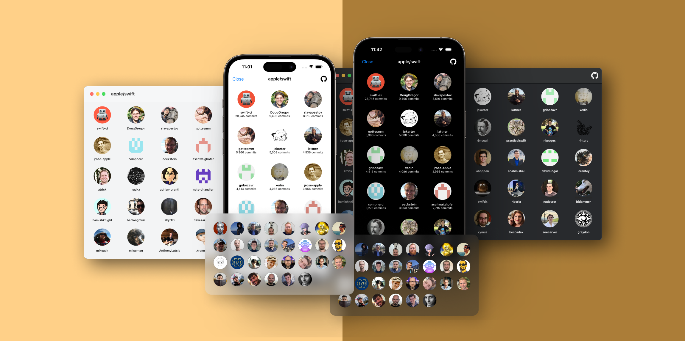

<p align="center">

</p>

**ContributorUI** is a library for user interface available for iOS and macOS applications, aimed at displaying all developers who are contributing to the project.

<p align="center">

</p>

## ⚙️ Setup
To access GitHub API, you need to feed personal access token into **ContributorUI**. Firstly, create a token under **Developer Settings** and add it somewhere safe in the project. Then call `configure(with:)` with your token key.
```swift
ContributorUI.configure(with: <token>)
```
> For those who want to access private repository, make sure you enable repo scope when creating your token.

Without the token key, GitHub API allows to access public repository with a **lower** rate limit. If you need a higher rate limit, it is **mandatory** to add the token key. If not, you will end up getting **unauthorized error**.


## 💡 Features
- [ContributorCard](#contributor-card)
- [ContributorList](#contributor-list)

### ContributorCard <a id="contributor-card"></a>
ContributorCard highlights the top contributors of the project in a card style. It can be placed in a specific screen to show the top committers.

#### Usage
```swift
ContributorCard(owner: <owner>,repo: <repo>)
    .padding(20)
    .backgroundStyle(.thinMaterial)
    .estimatedSize(38)
    .minimumCardRowCount(1)
    .maximumDisplayCount(30)
```

### ContributorList <a id="contributor-list"></a>
ContributorList showcases all contributors of the project in table or grid style with infinite scroll behaviour. It can be shown via sheet or full screen cover in your application.

#### Usage
```swift
ContributorList(owner: <owner>,repo: <repo>)
    .contributorListStyle(.grid)
    .showsCommits(true)
```

### UIKit and AppKit Support
**ContributorUI** comes with the handy view controllers and views for UIKit and AppKit to utilize them in ease even though it is natively developed in SwiftUI. The following table provides the corresponding view controllers and views in UIKit and AppKit.
<table>
<tr>
<th>SwiftUI</th>
<th>UIKit</th>
<th>AppKit</th>
</tr>
<tr>
<td>ContributorCard</td>
<td>UIContributorCard</td>
<td>NSContributorCard</td>
</tr>
<tr>
<td>ContributorList</td>
<td>UIContributorListController</td>
<td>NSContributorListController</td>
</tr>
</table>

## ⚠️ Requirements 
- iOS 16+, macOS 13+
> ContributorUI is developed using Xcode 14.2. Make sure you are using Xcode 14.2 and above.

## 🛠 Installation 
### 📦 Using Swift Package Manager
Add it as a dependency within your Package.swift.
```
dependencies: [
    .package(url: "https://github.com/dscyrescotti/ContributorUI.git", from: "1.0.1")
]
```
### 🎁 Using CocoaPods
Add it inside your Podfile.
```
pod 'ContributorUI', '~> 1.0.1'
```

## 🔎 Exploration

### Demo Project
**ContributorUI** also comes with the demo project which is an optimal spot to explore the usages. To run the demo project, you can use the following commands in your terminal.
```
> git clone https://github.com/dscyrescotti/ContributorUI.git
> cd ContributorUI && xed Demo/Demo
```
Afterwards, Xcode will open the project and then you can hit ⌘+R to run the project.
> For those using UIKit or AppKit, you can check out `Demo/Demo-UIKit` and `Demo/Demo-AppKit`.

## 🏆 Inspiration
**ContributorUI** is inspried by [contrib.rocks](https://contrib.rocks/) and is developed to praise the contributors of the project in iOS and macOS applications with a minimal setup.

## ✍️ Author
Dscyre Scotti | [@dscyrescotti](https://twitter.com/dscyrescotti) 

<p>
<a href="https://twitter.com/dscyrescotti">

</a>
&nbsp;
<a href="https://mastodon.social/@dscyrescotti">

</a>
&nbsp;
<a href="https://github.com/dscyrescotti">

</a>
</p>

## 👨‍💻 Contributions

**ContributorUI**  welcomes all developers to contribute if you have any idea to enhance and open an issue if you encounter any bug.

## © License

**ContributorUI** is available under the MIT license. See the  [LICENSE](https://github.com/dscyrescotti/ContributorUI/blob/main/LICENSE)  file for more info.
